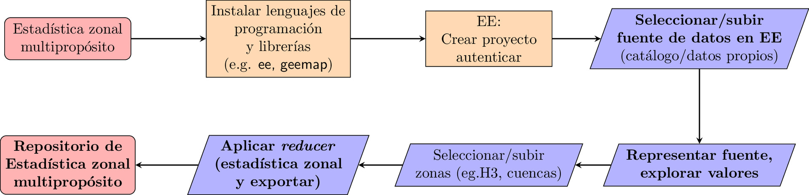

```{r setup, include=FALSE, echo=F}
knitr::opts_chunk$set(echo = FALSE)
ruta_figuras <- 'img/'
```

# JUSTIFICACIÓN

## 
<section style="font-size: 72px; text-align: center;">

"Quienes nos 'criamos' en la era del *apuñaleo*, sufrimos con la sequía de fuentes de información. Nos marcó, y aún no superamos el trauma. Esto lo justifica todo, *bye*"

</section>

##

- Fuera de broma, **obtener información** colectada de forma sistemática de un territorio pequeño, pero complejo, como lo es República Dominicana, aún en la era del *big data* y la IA, **sigue siendo un desafío**.

- Si encima necesitamos consultar **métodos, metadatos o informes técnicos**, la cosa se complica aún más.

- Aunque la reproducibilidad se exige cada día más en estudios a nivel global, cuando utilizamos fuentes de datos nacionales, **se nos dificulta encontrar protocolos reproducibles**.

##

- Este artículo de datos pretende llenar ese vacío.

- El objetivo consiste en poner **a disposición del público, un artículo de datos reproducible y actualizable**, que contenga **información geográfica** de República Dominicana, agrupada en **unidades territoriales** de distinto tamaño o forma por medio de estadística zonal, útil para realizar **análisis espacial multipropósito**.

# MATERIALES Y MÉTODOS

```{bash, eval=F, include=F, echo=F}
cd img
convert -density 300 -background white -alpha remove -alpha off -resize 1920x \
  metodologia-grafica.pdf \
  metodologia-grafica.jpg
cd ..
```

## 

## ¿Qué es Google Earth Engine?

- Es una **plataforma de análisis geoespacial en la nube que ofrece una extensa base de datos del orden de los petabytes**, para monitorear y analizar cambios en la superficie de la Tierra, apoyando investigaciones ambientales, manejo de recursos y planificación territorial.

- Utiliza la infraestructura de computación en la nube de Google para procesar y almacenar esta gran cantidad de información geoespacial.

- El acceso a Google Earth Engine es gratuito para fines de investigación, educación y uso sin fines de lucro.

- Hay otras del mismo orden, como la Microsoft Planetary Computer.

## 


## CASOS DE USO


## Asignatura biogeografía: GBIF, campus UASD


## Asignatura geomorfología


## Criterios para la selección de sitios de estaciones meteoclimáticas


## Provincias de República Dominicana


# RESULTADOS

## Cuenca del río Masacre o Dajabón


# DISCUSIÓN

- El concepto de "*global*"

- Potencial de utilizar herramientas de IA muy potentes, como SAM.

- Futuros trabajos:

    - Automatización de procesos.
    - Aplicaciones web.

# 

<section style="font-size: 72px; text-align: center;">

<br>

 jmartinez19\@uasd.edu.do

 geofis

</section>
